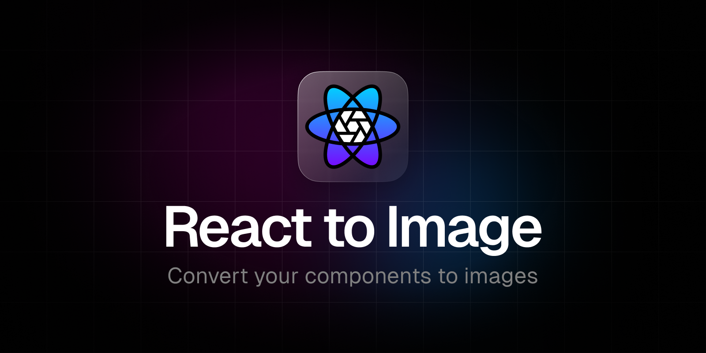

<div align="center">

[](https://www.npmjs.com/package/@hugocxl/react-to-image)
[](https://www.npmjs.com/package/@hugocxl/react-to-image)
[](https://bundlephobia.com/result?p=@hugocxl/react-to-image)
[](https://bundlephobia.com/result?p=@hugocxl/react-to-image)
[](https://coveralls.io/github/hugocxl/react-to-image)
[](https://www.typescriptlang.org)
[](https://www.npmjs.com/package/@hugocxl/react-to-image)

</div>

## Features

- ✨ **Simple**: is simple to use and has no external dependencies at all
- 🌱 **Lightweight**: just 797b gzipped
- 💎 **TypeScript**: full-written in TypeScript
- 🚀 **React Hooks**
- ⚛️ **State Management** - Control conversion states
- ⌛️ **Async Logic** – Event handlers for asynchronous logic
- 🏆 **MIT Licensed**: free for personal and commercial use

## Table of Contents

- [Installation](#installation)
- [Usage](#usage)
- [Docs](#docs)
  - [Ref](#ref)
  - [Fn](#fn)
  - [State](#state)
  - [Option](#options)
- [Contributing](#contributing)
- [Code of Conduct](#code-of-conduct)
- [License](#license)

## Installation

In order to use **`@hugocxl/react-to-image`**, all you need to do is install the
npm package:

```sh
pnpm add @hugocxl/react-to-image
```

> **`html-to-image`** and **`react`** are **peerDependencies** of
> **`react-to-image`**, you may **install your own versions**.

## Introduction

`html-to-image` is an invaluable utility library that enables the generation of
images from a DOM node utilising the power of HTML5 canvas and SVG. It provides
a seamless way to convert HTML elements into visual representations.

`react-to-image` further enhances the integration of `html-to-image` with React
leveraging the capabilities of `html-to-image` and offering a simplified and
intuitive approach for generating images from React components.

## Usage

To start using `@hugocxl/react-to-image`, you just need to import any of the
hooks from the package.

```tsx
import { useToSvg } from '@hugocxl/react-to-image'

function App() {
  const [ref, convertToSvg] = useToSvg<HTMLDivElement>({
    onSuccess: data => {
      console.log(data)
    }
  })

  return (
    <div ref={ref}>
      <h1>Title</h1>
      <button onClick={convertToSvg}>Convert to PNG</button>
    </div>
  )
}
```

The current hooks are being exported:

- useToSvg
- useToPng
- useToJpeg
- useToCanvas
- useToBlob

### Download

Some hooks are provided to ease the download, being a frequent use case

```tsx
import { useDownloadAsPng } from '@hugocxl/react-to-image'

function App() {
  const [ref, downloadAsPng, { isLoading }] = useDownloadAsPng<HTMLDivElement>()

  return (
    <div ref={ref}>
      <h1>Title</h1>
      <button onClick={downloadAsPng}>Convert to PNG</button>
      {isLoading && <div>Loading...</div>}
    </div>
  )
}
```

The current hooks are being exported:

- useDownloadAsSvg
- useDownloadAsPng
- useDownloadAsJpeg
- useDownloadAsCanvas
- useDownloadAsBlob

The default function used to download the image is:

```ts
function download(data) {
  const link = document.createElement('a')
  link.download = `${fileName}.${format}`
  link.href = data
  link.click()
}
```

## Docs

```tsx
const [ref, fn, state] = hook(options)
```

### Ref

The ref to be passed down to the HTML element that you want to capture as an
image.

### Fn

The function to be called to convert the image.

### State

| name        |    type     | description                                                                                                                             |
| ----------- | :---------: | --------------------------------------------------------------------------------------------------------------------------------------- |
| `isIdle`    | **boolean** | if the conversion is idle. It's only true if no conversion has been initialized yet                                                     |
| `isLoading` | **boolean** | If the conversion is currently being done                                                                                               |
| `isError`   | **boolean** | If the conversion has failed                                                                                                            |
| `isSuccess` | **boolean** | If the conversion has succesfully finished                                                                                              |
| `error`     |   **any**   | If the conversion attempt resulted in an error. The corresponding `error` property has the error received from the attempted conversion |
| `data`      |   **any**   | The last successfully resolved data for the conversion                                                                                  |

```tsx
import { useDownloadAsPng } from '@hugocxl/react-to-image'

function App() {
  const [ref, downloadAsPng, { error, isError, isLoading }] =
    useDownloadAsPng<HTMLDivElement>()

  return (
    <div ref={ref}>
      <h1>Title</h1>
      <button onClick={downloadAsPng}>Convert to PNG</button>

      {isLoading && <span>Loading...</span>}
      {isError && (
        <details>
          <summary>There was an error converting the image</summary>
          <div>{error.message}</div>
        </details>
      )}
    </div>
  )
}
```

### Options

Apart from the following, you have all the options available to
[`html-to-image`](https://github.com/bubkoo/html-to-image/tree/master#options)

| name        |    type     | description                                                |
| ----------- | :---------: | ---------------------------------------------------------- |
| `onStart`   | **boolean** | Callback called if the conversion is starting              |
| `onSuccess` | **boolean** | Callback called if the conversion has finished succesfully |
| `onError`   | **boolean** | Callback called if the conversion has thrown an error      |

```tsx
import { useToPng } from '@hugocxl/react-to-image'

function App() {
  const [ref, toPng] = useToPng<HTMLDivElement>({
    backgroundColor: 'red',
    quality: 0.5,
    // ...rest of html-to-image options
    onStart: () => console.log('Starting'),
    onSuccess: data => console.log('Success', data),
    onError: error => console.log('Error', error)
  })

  return (
    <div ref={ref}>
      <h1>Title</h1>
      <button onClick={toPng}>Convert to PNG</button>
    </div>
  )
}
```

## Examples

### Clip to clipboard

Convert a component to a PNG and copy the image to the clipboard

```tsx
import { useToPng } from '@hugocxl/react-to-image'

export default function App() {
  const [ref, onClickButton, { isSuccess }] = useToPng<HTMLDivElement>({
    onSuccess: data => navigator.clipboard.writeText(data)
  })

  return (
    <div ref={ref}>
      <h1>Title</h1>
      <button onClick={onClickButton}>Copy to clipboard</button>

      {isSuccess && <span>Image copied to the clipboard!</span>}
    </div>
  )
}
```

## Contributing

No one’s perfect. If you’ve found any errors, want to suggest enhancements, or
expand on a topic, please feel free to open an Issue or collaborate by PR.

## Code of Conduct

[Contributor Code of Conduct](public/docs/CODE_OF_CONDUCT.md). By participating
in this project you agree to abide by its terms.

## License

**@hugocxl/react-to-image** is open source software licensed as MIT ©
[Hugo Corta](https://github.com/hugocxl).

---

**Made with ♥ by [@hugocxl](https://hugocxl.me)**
