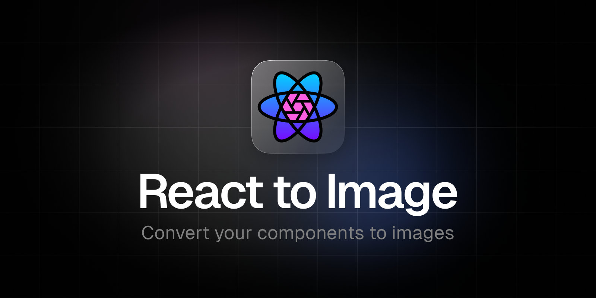

<div align="center">

[](https://www.npmjs.com/package/@hugocxl/react-to-image)
[](https://www.npmjs.com/package/@hugocxl/react-to-image)
[](https://bundlephobia.com/result?p=@hugocxl/react-to-image)
[](https://github.com/hugocxl/react-to-image/actions/workflows/release.yml)
[](https://coveralls.io/github/hugocxl/react-to-image)
[](https://www.typescriptlang.org)
[](https://www.npmjs.com/package/@hugocxl/react-to-image)

</div>

## Features

- ✨ **Simple**: is simple to use and has no external dependencies at all
- 🌱 **Lightweight**: just 983b gzipped
- 💎 **TypeScript**: full-written in TypeScript
- ⚛️ **State Management**: control conversion states
- ⌛️ **Async Logic**: event handlers for asynchronous logic
- 🏆 **MIT Licensed**: free for personal and commercial use
- 🚀 **React Hooks**

## Table of Contents

- [Installation](#installation)
- [Usage](#usage)
- [Docs](#docs)
  - [State](#state)
  - [Ref](#ref)
  - [Fn](#fn)
  - [Option](#options)
- [Examples](#examples)
- [Contributing](#contributing)
- [Code of Conduct](#code-of-conduct)
- [License](#license)

## Installation

In order to use **`@hugocxl/react-to-image`**, all you need to do is install the
npm package:

```sh
npm i @hugocxl/react-to-image

pnpm add @hugocxl/react-to-image
```

## Introduction

[`html-to-image`](https://github.com/bubkoo/html-to-image/tree/master#options) is an invaluable utility library that enables the generation of
images from a DOM node utilising the power of HTML5 canvas and SVG. It provides
a seamless way to convert HTML elements into visual representations.

**`react-to-image`** further enhances the integration of this library with React leveraging the capabilities of `html-to-image` and offering a simplified and intuitive approach for generating images from React components.

## Usage

To start using `@hugocxl/react-to-image`, you just need to import any of the
hooks from the package.

```tsx
import { useToSvg } from '@hugocxl/react-to-image'

function App() {
  const [state, convertToSvg, ref] = useToSvg<HTMLDivElement>({
    onSuccess: data => {
      console.log(data)
    }
  })

  return (
    <div ref={ref}>
      <h1>My component</h1>
      <button onClick={convertToSvg}>Convert to PNG</button>
    </div>
  )
}
```

## Docs

### Hooks

```tsx
const [state: State, fn: Fn, ref: Ref] = hook<HtmlElement>(options: Options)
```

The current hooks are being exported:

- `useToSvg`
- `useToPng`
- `useToJpeg`
- `useToCanvas`
- `useToBlob`

### `State`

| name        |    type     | description                                                                                                                             |
| ----------- | :---------: | --------------------------------------------------------------------------------------------------------------------------------------- |
| **data**      | `ReturnType<fn>`  | The last successfully resolved data for the conversion                                                                                  |
| **error**     | `string`  | If the conversion attempt resulted in an error. The corresponding `error` property has the error received from the attempted conversion |
| **status**    | `string` | state of the conversion. Posible values: `IDLE`, `LOADING`, `SUCCESS`, `ERROR`                                                           |
| **isIdle**    | `boolean` | if the conversion is idle. It's only true if no conversion has been initialized yet                                                     |
| **isLoading** | `boolean` | If the conversion is currently being done                                                                                               |
| **isError**   | `boolean` | If the conversion has failed                                                                                                            |
| **isSuccess** | `boolean` | If the conversion has succesfully finished                                                                                              |

### `Fn`

The function to be called to convert the image.

### `Ref`

The ref to be passed down to the HTML element that you want to capture as an
image.

### `Options`

Apart from the following, you have all the options available to
[`html-to-image`](https://github.com/bubkoo/html-to-image/tree/master#options)

| name        |    type     | description                                                |
| ----------- | :---------: | ---------------------------------------------------------- |
| **selector**  | `string` | A valid `querySelector()` argument. If passed, the ref will be ommited              |
| **onStart**   | `boolean` | Callback called if the conversion is starting              |
| **onSuccess** | `boolean` | Callback called if the conversion has finished succesfully |
| **onError**   | `boolean` | Callback called if the conversion has thrown an error      |

## Examples

### Using `selector`

Use the selector option to specify the element that you want to capture instead of the ref. Useful if you need to convert elements that are far in the application structure.

```tsx
import { useToPng } from '@hugocxl/react-to-image'

export default function App() {
  const [state, convert] = useToPng<HTMLDivElement>({
    selector: '#my-element',
    onSuccess: data => console.log('Converted #my-element to PNG!', data),
  })

  return (
    <div>
      <button onClick={convert}>Copy to clipboard</button>
    </div>
  )
}
```

### Using callbacks (`onStart`, `onSuccess`, `onError`)

```tsx
import { useToBlob } from '@hugocxl/react-to-image'

export default function App() {
  const [_, convert, ref] = useToBlob<HTMLDivElement>({
    onStart: data => console.log('Starting...'),
    onSuccess: data => console.log('Success', data),
    onError: error => console.log('Error', error),
  })

  return (
    <div ref={ref}>
      <h1>My component</h1>
      <button onClick={convert}>Download</button>
    </div>
  )
}
```

### Save and download a compressed JPEG image

```tsx
import { useToPng } from '@hugocxl/react-to-image'

export default function App() {
  const [_, convert, ref] = useToPng<HTMLDivElement>({
    quality: 0.8,
    onSuccess: data => {
      const link = document.createElement('a');
      link.download = 'my-image-name.jpeg';
      link.href = data;
      link.click();
    }
  })

  return (
    <div ref={ref}>
      <h1>My component</h1>
      <button onClick={convert}>Download</button>
    </div>
  )
}
```

### Clip to clipboard

Convert a component to a PNG and copy the image to the clipboard

```tsx
import { useToPng } from '@hugocxl/react-to-image'

export default function App() {
  const [{ isSuccess }, convert, ref] = useToPng<HTMLDivElement>({
    onSuccess: data => navigator.clipboard.writeText(data)
  })

  return (
    <div ref={ref}>
      <h1>My component</h1>
      <button onClick={convert}>Copy to clipboard</button>

      {isSuccess && <span>Image copied to the clipboard!</span>}
    </div>
  )
}
```

### Display an error message if the conversion fails

```tsx
import { useToSvg } from '@hugocxl/react-to-image'

export default function App() {
  const [{ isError, error }, convert, ref] = useToSvg<HTMLDivElement>()

  return (
    <div ref={ref}>
    <button onClick={convert}>Convert</button>
      <p>
        Lorem ipsum dolor sit amet, consectetur adipiscing elit. 
      </p>
      
      
      {isError && <span>{`Sorry, there was an error converting the image: ${error}`}</span>}
    </div>
  )
}
```

### Get a PNG image base64-encoded data URL and append it to the document

```tsx
import { useToPng } from '@hugocxl/react-to-image'

export default function App() {
  const [{ isLoading }, convert, ref] = useToPng<HTMLDivElement>({
    onSuccess: dataUrl => {
      const img = new Image();
      img.src = dataUrl;
      document.body.appendChild(img);
    }
  })

  return (
    <div ref={ref}>
      <h1>My component</h1>
      <button onClick={convert}>Inject image</button>
      {isLoading && <span>Loading...</span>}
    </div>
  )
}
```

### Get a HTMLCanvasElement, and display it right away

```tsx
import { useToCanvas } from '@hugocxl/react-to-image'

export default function App() {
  const [{ isLoading }, convert, ref] = useToCanvas<HTMLDivElement>({
    onSuccess: canvas => document.body.appendChild(canvas);
  })

  return (
    <div ref={ref}>
      <h1>My component</h1>
      <button onClick={convert}>Inject canvas</button>
    </div>
  )
}
```

## Contributing

No one’s perfect. If you’ve found any errors, want to suggest enhancements, or
expand on a topic, please feel free to open an Issue or collaborate by PR.

## Code of Conduct

[Contributor Code of Conduct](public/docs/CODE_OF_CONDUCT.md). By participating
in this project you agree to abide by its terms.

## License

**@hugocxl/react-to-image** is open source software licensed as MIT ©
[Hugo Corta](https://github.com/hugocxl).

---

**Made with ♥ by [@hugocxl](https://hugocxl.me)**
